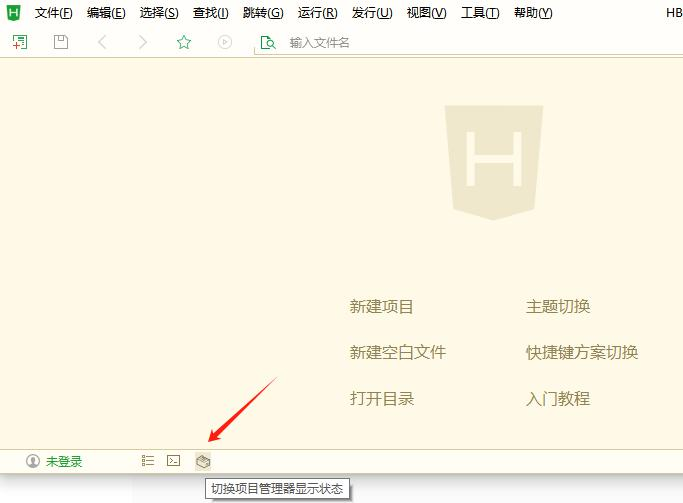

# 项目管理器显示切换

## 这是什么？

在IDE状态栏左侧添加一个可以切换左侧 `项目管理器` 显示状态的按钮

等同于以下操作/内容： 

* `快捷键Alt+Q`
	* 其本质是命令：`workbench.action.toggleSidebarVisibility`
* 双击标签
* 工具栏 > 视图 > 显示项目管理器等左侧视图(P)
* 鼠标悬浮在IDE最左侧时显示的展开箭头

## 为什么写这个插件？

虽然IDE本身提供了若干方式来切换项目管理器的显示状态，通过 `视图` 下面的选项来调整界面也是一种很常见的操作。

但是鼠标点点点也是一种常规操作。

## 一点小问题

* 图标不能放在终端图标或者更前面的位置，介意勿用

通过hx的api创建图标时，即使权重设置很高，也没能实现更前面的位置。
> 盲猜官方的机制不允许自定义图标超过内置图标的位置。

## 配置

// todo
### 可以自定义图标（仅简单的文本输入）

* 图标内容（简易文本，比如emoji）
* 图表颜色（支持颜色名称、RGB和十六进制）

